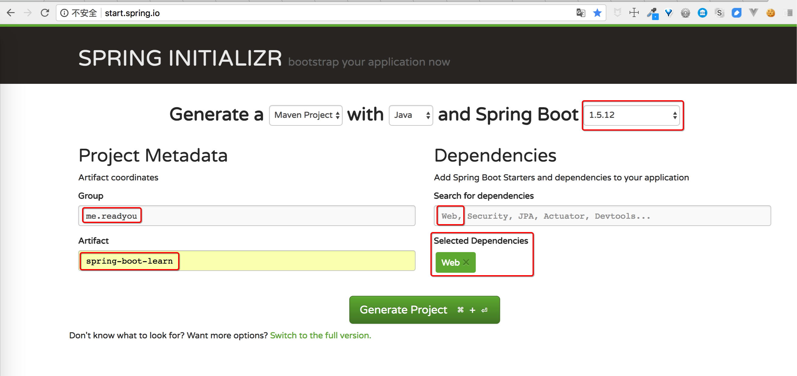
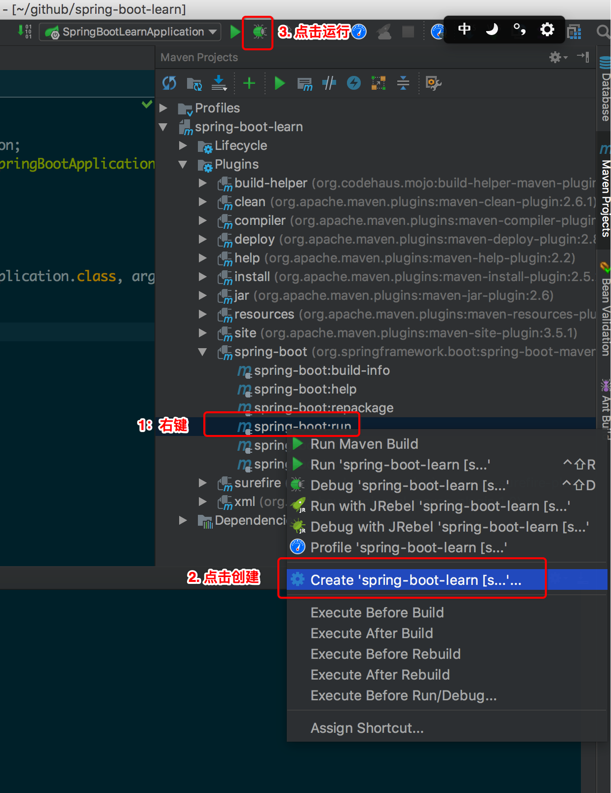

# 工程初始化
1. 访问网站：http://start.spring.io/。
1. 填写表单。
1. 点击『Generate Project』的按钮，下载文件并解压。
    
    说明：
    1. 这里版本号可能不是最新的。
    2. `Search for dependencies `中输入的文字在选择的时候会清空，图片上看不到。
1. 在`Maven Projects`窗口中选择`spring-boot-learn>Plugins>spring-boot>spring-boot:run`，右键选择`Create 'spring-boot-learn [s...'`，创建`Debug Configurations`。
1. 点击绿色的`Debug`按钮，启动工程。
    
    不出意外的话，能看到输出：
    ```
    ...
    2018-05-02 21:06:30.461  INFO 3273 --- [           main] o.s.j.e.a.AnnotationMBeanExporter        : Registering beans for JMX exposure on startup
    2018-05-02 21:06:30.507  INFO 3273 --- [           main] s.b.c.e.t.TomcatEmbeddedServletContainer : Tomcat started on port(s): 8080 (http)
    2018-05-02 21:06:30.510  INFO 3273 --- [           main] m.r.s.SpringBootLearnApplication         : Started SpringBootLearnApplication in 2.104 seconds (JVM running for 2.754)
    ```
1. 打开浏览器，地址栏中输入：`localhost:8080`，将看到错误信息。因为此时我们还没有注册任何路由。
1. 在`SpringBootLearnApplication.java`所在的目录添加目录`controller`（将不同类型的类放到不同的文件夹下的习惯），并在该目录下新建文件`HelloController`，内容如下：
    ```
    package me.readyou.springbootlearn.controller;
    
    import org.springframework.web.bind.annotation.RequestMapping;
    import org.springframework.web.bind.annotation.ResponseBody;
    import org.springframework.web.bind.annotation.RestController;
    
    /**
     * Created by wuxinlong on 18/5/2.
     */
    @RestController
    public class HelloController {
        @RequestMapping("/")
        @ResponseBody
        String home() {
            return "Hello World!";
        }
    }
    ```
1. 再次启动，访问`localhost:8080`，将看到`Hello World!`。


